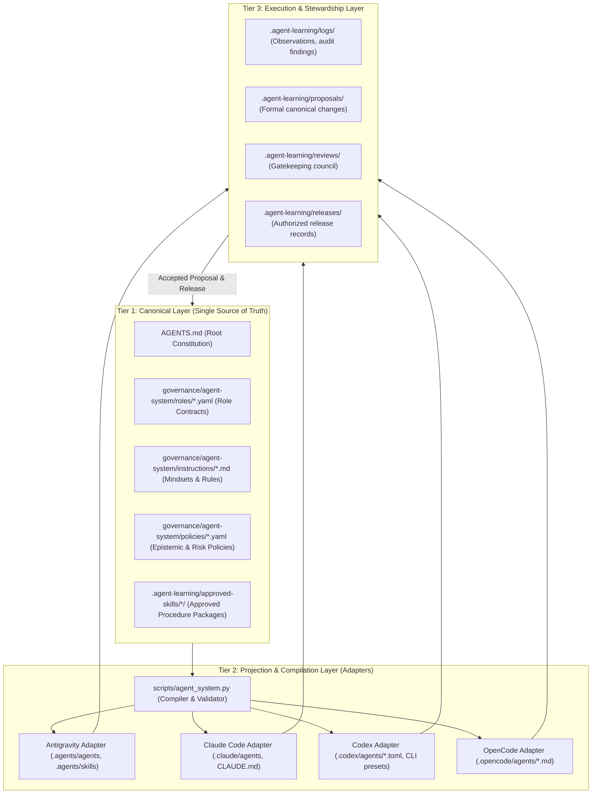

# Multi-Harness Universal Agent Architecture Specification

**Status:** Canonical Governance Specification  
**Version:** 1.0.0  
**Scope:** Google Antigravity, Anthropic Claude Code, OpenAI Codex, OpenCode  
**Authoritative Location:** `governance/agent-system/architecture.md`  

---

## 1. Core Principle & Purpose

Before We Build relies on strict epistemic boundaries, falsifiability, evidence labeling, and caveat preservation across typological, psychological, theological, and scientific domains. Agent instructions within this system are **governance artifacts**, not disposable configuration files.

This specification establishes a **three-tier architecture** that decouples the canonical definition of agent responsibilities and safety invariants from the concrete execution runtimes (harnesses).

---

## 2. The Three Architectural Tiers

### Tier 1: Canonical Layer (Vendor-Agnostic Core)
The canonical layer defines **what** each role is responsible for, its epistemic boundaries, its accountability, and what it must never do. It contains no vendor-specific model slugs (e.g. `openai/gpt-5.5`), no harness-specific permission syntax, and no raw tool call declarations.

Components:
1. **`AGENTS.md`**: The constitutional foundation. Manually maintained by human custodians. Defines repository-wide axioms, multi-language triad policies, and fundamental research boundaries.
2. **`governance/agent-system/roles/<role-id>.yaml`**: Machine-readable role contract conforming to `role.schema.json`.
3. **`governance/agent-system/instructions/<role-id>.md`**: Canonical thinking instructions, domain principles, and hard boundary rules.
4. **`governance/agent-system/policies/*.yaml`**: Reusable policy modules (e.g. `epistemic-caveats`, `change-control`, `review-routing`).
5. **`.agent-learning/approved-skills/<skill-id>/`**: Canonical procedures conforming to the Agent Skills open standard (`SKILL.md` + optional scripts/references).

### Tier 2: Projection & Compilation Layer (Adapters)
Because each vendor platform (Google, Anthropic, OpenAI) utilizes differing configuration schemas, context injection vectors, and permission sandboxes, canonical definitions are **projected** deterministically into harness-specific directories:

| Target Harness | Projection Output | Entry Point & Rules Mechanism |
| :--- | :--- | :--- |
| **Google Antigravity** | `.agents/agents/*.md` `.agents/skills/<skill>/` | `AGENTS.md` (injected via `<user_rules>`), `.agents/rules/` |
| **Anthropic Claude Code** | `.claude/agents/*.md` `.claude/skills/` | `CLAUDE.md` (imports `@AGENTS.md`) |
| **OpenAI Codex** | `.codex/agents/*.toml` `.agents/skills/` | `AGENTS.md`, `CODEX_HOME` isolation, execution presets |
| **OpenCode** | `.opencode/agents/*.md` | `opencode.json`, `.opencode/ORGANIZATION.md` |

**Compilation Rules:**
- Compilation is strictly **one-way**: `Canonical → Projections`.
- Runtime directories are marked as generated. Direct manual edits are rejected by CI drift checks (`agent_system.py check-drift`).
- Every compilation produces a **Compliance & Capability Report**, detailing which canonical invariants are enforced by runtime sandbox vs. system prompt vs. unsupported.

### Tier 3: Execution, Stewardship & Learning Layer
All iterative improvements follow the proposal-first, review-gated governance workflow:
- **Observation / Audit:** Logged in `.agent-learning/logs/`.
- **Proposal:** Authored in `.agent-learning/proposals/` targeting **canonical entities** (`governance/agent-system/roles/`), not target projection files.
- **Review:** Evaluated by domain gatekeepers (`empirical-claims-caveats-reviewer`, `source-provenance-auditor`, theologians, psychometricians) in `.agent-learning/reviews/`.
- **Release Authorization:** Upon explicit human approval, a release record is created in `.agent-learning/releases/`, and the compiler updates projections across all active targets.

---

## 3. Capability Intersection & Authority Invariant

To ensure safety across different tool execution models, the effective capability of an agent during execution is governed by the **Capability Intersection Formula**:

$$\text{Effective Action} = \text{Environment Limits} \cap \text{Project Constitution} \cap \text{Role Contract} \cap \text{Task Grant}$$

1. **Environment Limits:** Sandbox boundaries enforced by the host harness (e.g. Antigravity Sandbox, Codex read-only mode).
2. **Project Constitution:** Non-negotiable limits declared in `AGENTS.md` (e.g. prohibition of deterministic compatibility scores, no silent file rewrites).
3. **Role Contract:** Specific permissions defined in `governance/agent-system/roles/<id>.yaml` (e.g. whether a role can propose changes or execute terminal commands).
4. **Task Grant:** Specific user approval for a given conversation or operation.

---

## 4. Distinct Relationships in Role Contracts

The architecture strictly separates four concepts that are often conflated in agent prompts:

1. **Accountability (`reports_to`):** Who is responsible for the quality and delivery of this agent's work (e.g. `master-orchestrator`).
2. **Delegation (`may_delegate_to`):** Which specific specialized roles this agent is authorized to invoke or spawn.
3. **Review Gate (`required_reviewers`):** Whose explicit concurrence is necessary before this agent's output can be merged or activated.
4. **Capabilities (`capabilities`):** What abstract tool operations the agent requires (e.g. `fs.read`, `fs.write`, `exec.sandboxed`, `web.search`).

---

## 5. Drift Prevention & Verification Pipeline

1. **Static Validation:** `scripts/agent_system.py validate` parses all YAML and JSON schemas, checks reference integrity, and verifies that instructions exist.
2. **Deterministic Build:** `scripts/agent_system.py build` compiles projections.
3. **Drift Verification:** `scripts/agent_system.py check-drift` computes SHA-256 digests of all generated files against expected compilation output. If any manual edits occurred in `.opencode/agents/` or `.claude/agents/`, CI fails.
4. **Runtime Probes:** Non-blocking probes check target harness reachability and config parsing.
