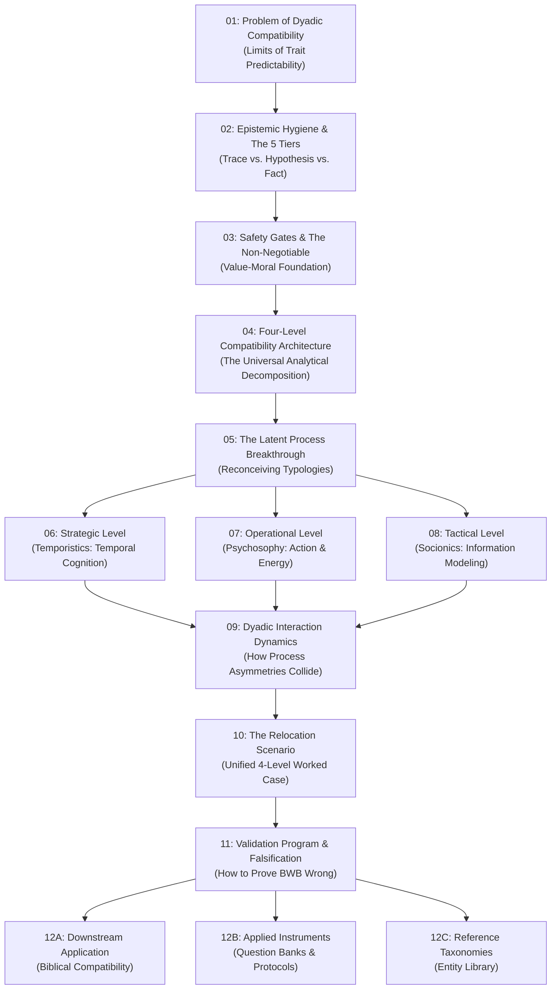

# EDITORIAL ARCHITECTURE COUNCIL
## Master Blueprint & Migration Plan: Transforming Before We Build into a Rigorous Knowledge System for Quartz

**Date:** 2026-09-05
**Convened by:** Orchestrator & Chief Editorial Architect
**In Co-Session with:** OpenAI Codex CLI (`codex-cli` / `gpt-6-astra` analytical pair)
**Council Agents:**
1. *Agent 1 — Information Architect*
2. *Agent 2 — Developmental Editor*
3. *Agent 3 — Learning Experience Architect*
4. *Agent 4 — Narrative & Popular Science Editor*
5. *Agent 5 — Knowledge Graph Architect*
6. *Agent 6 — Documentation UX Architect*

---

## 1. COUNCIL DELIBERATION RECORD (Phases 1–8)

### Phase 1 — Document Inventory & State Analysis
The repository comprises **791 Markdown files** distributed across functional zones:
- **`wiki/` (627 files / 209 triads):** Strictly synchronized English, Russian, and Ukrainian documents.
  - *5 Hubs* (`start-here`, `main-idea`, `four-level-compatibility-architecture`, `epistemic-status-and-inference-limits`, `glossary-core`).
  - *43 Explanations* (theoretical models, level boundaries, mechanisms, notation registries).
  - *83 Entities* (3 system overviews, 16 Socionics types, 24 Psychosophy types, 24 Temporistics types, 16 Temporistics aspect-position archetypes).
  - *4 Relations* (intertype relations across the systems and cognitive complexity).
  - *39 Source Summaries* (classical foundational literature, recent empirical psychology, and neuroscience).
  - *27 Research Appendices* (methodological audits, combinatorics, measurement roadmaps).
  - *8 Application Guides* (Christian application overviews, family formation, spiritual maturity).
- **`applications/` (54 files):** Domain specializations, anchored by `biblical-compatibility/` (53 files written in Ukrainian based on the manuscript *«Сумісність для одиноких християн»*, featuring 19 hermeneutical studies, 15 pastoral themes, and 9 typology integration papers).
- **`research/` (10 files):** Empirical case studies (Ukrainian & regional public figures: Zaluzhnyi, Zelenskyi, Tarabarova, Dud, Morgenshtern), instruments (`pilot-question-bank.md`), and academic outreach packets.
- **`protocols/` (16 files):** Operational protocols for academic translation, typing interviews, and science communication (`scientific-narrative-intelligence-layer.md`).
- **`governance/` (2 files):** Legal, ethical, and public figure analysis boundaries.
- **`raw/` (78 files):** Immutable source documents, transcripts, and notes.

---

### Phase 2 — Concept Extraction & Preliminary Ontology
The Council extracted the core constructs across 5 epistemological tiers:
1. **The Ground Truth Tier (Facts & Observations):** Observable communicative traces, task division, conflict repair attempts, verbal choices, physiological/hyperscanning markers under stress, stated non-negotiables, explicit consent/refusal.
2. **The Normative Foundation Tier (Value-Moral Grounding):** Worldview commitments, ethical obligations, human dignity, non-negotiable boundaries, abuse/coercion vetoes. (Not a typology; non-compensable).
3. **The Latent Process Hypotheses (The 3 Engines):**
   - *Strategic (Temporistics):* Latent structuring of temporal/existential experience (abduction, induction, deduction across Past, Present, Future, Eternity).
   - *Operational (Psychosophy):* Latent organization of joint action, resource allocation, and decision priorities (analysis and synthesis across Emotion, Logic, Physics, Volition).
   - *Tactical (Socionics):* Latent selection, compression, organization, inference, and updating of partial information models of shared reality (8 information elements across Model A positions).
4. **The Interaction & Dyadic Dynamics Tier:** Intertype relation hypotheses, dualization/activation/conflict dynamics, transactive goal dynamics, and communicative friction points.
5. **The Application & Context Tier:** Concrete institutional and relational manifestations (Christian marital discernment in Ukraine, cross-functional teams, military coordination, dating product concepts).

---

### Phase 3 — Dependency Analysis & Cognitive Leap Detection
In joint session with OpenAI Codex CLI (`codex exec`), the Council detected severe structural bottlenecks in the existing network:
- **The "Taxonomic Cliff":** Readers move directly from `start-here` into an avalanche of 83 discrete entity pages (e.g., `pefn`, `elvf`, `sli-sensory-logical-introvert`) without encountering the intermediate justification for why four positions exist, why discrete permutations are assumed, or how individual profiles interact.
- **The Empirical Misattribution Gap:** The literature review (e.g., Joel, Eastwick, & Finkel 2020) is cited as proving that "contemporary relationship science has failed," whereas it specifically showed that static self-report trait inventories (like the Big Five) predict baseline satisfaction moderately but fail to predict longitudinal change or dyadic interaction trajectories. BWB needs to articulate why dyadic latent-process modeling is the missing explanatory bridge.
- **Core vs. Worldview Tangling:** Readers seeking universal dyadic science encounter Ukrainian Baptist theological audits embedded in `wiki/concepts/`, while readers seeking the pastoral book encounter dry epistemological caveats without an immediate pastoral bridge.

---

### Phase 4 — Independent Agent Proposals

#### Proposal 1: Information Architect (Taxonomic Strictness)
- Group by formal ontology and epistemological category.
- Sections:
  - `01-epistemology-and-methodology/`
  - `02-universal-four-level-model/`
  - `03-latent-process-hypotheses/`
  - `04-typological-reference-library/` (Socionics, Psychosophy, Temporistics)
  - `05-dyadic-interaction-models/`
  - `06-empirical-research-and-validation/`
  - `07-application-domains/`

#### Proposal 2: Developmental Editor (Cognitive Continuity)
- Optimize strictly for the question: *"What must the reader understand before this sentence makes sense?"*
- Sequence:
  - Chapter 1: The Human Dyad Problem (Why predicting compatibility fails).
  - Chapter 2: The Four Questions of Shared Action (Normative, Strategic, Operational, Tactical).
  - Chapter 3: From Traces to Latent Processes (De-reifying typologies).
  - Chapter 4: The Worked Scenario (The Relocation Case Study traced through all 4 levels).
  - Chapter 5: The Operational Engine (Psychosophy & Action).
  - Chapter 6: The Tactical Engine (Socionics & Information Modeling).
  - Chapter 7: The Strategic Engine (Temporistics & Meaning).
  - Chapter 8: Dyadic Friction and Intertype Mechanics.
  - Chapter 9: What Could Prove This Wrong (Validation Program).

#### Proposal 3: Learning Experience Architect (Pedagogical Competence Stages)
- Structure around reader mental models and "Unlock" gates (Levels 0–6).
- Progression:
  - *Level 0 (Curiosity & Deconstruction):* Deconstruct horoscope/MBTI matchmaking myths.
  - *Level 1 (Foundations):* Safety gates, moral non-negotiables, whole-person priority.
  - *Level 2 (The Unified Framework):* 4 levels as distinct functional planes.
  - *Level 3 (Mechanisms):* Latent processes, Model A, Afanasyev syntax, Temporistics time flow.
  - *Level 4 (Dyadic Interaction):* How complementary or conflicting processes collide.
  - *Level 5 (Field Applications):* Pastoral counseling, marital discernment, career role-fitting.
  - *Level 6 (Research Frontier):* Hyperscanning, pilot instruments, empirical falsification.

#### Proposal 4: Narrative & Popular Science Editor (Curiosity & Dramatic Tension)
- Follow the investigative arc of discovery using the SNIL protocol ($Q_i \to \Delta K_i \to Q_{i+1}$).
- Narrative Arc:
  - The Paradox of Modern Matchmaking (Millions of data points, zero dyadic foresight).
  - The Fatal Mistake: Trait vs. Process.
  - The Four Fault Lines of Any Human Enterprise (Obligation, Horizon, Resource, Signal).
  - The Cognitive Disassembly: Rescuing Soviet & post-Soviet typologies from esoteric folklore into cognitive hypotheses.
  - The Stress Test: A Ukrainian family in crisis / Wartime relocation decision.
  - The Frontier: How to scientifically falsify the architecture.

---

### Phase 5 — Editorial Debate & Synthesis

#### Disagreement 1: Position of the 83 Entity Pages
- **Proposal A (Information Architect):** Place the 83 entity pages immediately after each typology’s theoretical model in the primary sidebar.
- **Proposal B (Learning Architect & Codex):** Object. Exposing 83 discrete alphanumeric codes (`ELVF`, `SLI`, `1P-Author`) in the main navigation induces cognitive paralysis.
- **Resolution:** **The Reference Gateway Pattern.** The main Golden Path contains only the *System Overviews* (`socionics-overview`, `psychosophy-overview`, `temporistics-overview`) and the *Cognitive Mechanism Explanations*. All 80 individual type and archetype files are quarantined in a dedicated, collapsible **Reference Library**, accessed via gateway landing pages that mandate an epistemic disclaimer.

#### Disagreement 2: Positioning the Christian / Biblical Application
- **Proposal A (Narrative Editor):** Weave the Christian application into the main body as the primary concrete case study.
- **Proposal B (Information Architect & Chief Architect):** Veto. BWB's core is a universal, worldview-independent framework for *any two people*.
- **Resolution:** **Strict Architectural Downstream Decoupling.** The Core Knowledge System is strictly universal, objective, and worldview-neutral. The Christian Application (`applications/biblical-compatibility/`) is presented as **Specialization Track 1: Worldview & Church Discernment**, cleanly downstream, linking back to core concepts without contaminating core definitions.

#### Disagreement 3: Explanatory Order of the Typologies
- **Resolution:** **The Teleological Journey (Top-Down: Strategic $\to$ Operational $\to$ Tactical).** In real human enterprises, human beings first align on *Where are we going and what does time mean?* (Strategic / Temporistics), then *How do we decide and mobilize energy?* (Operational / Psychosophy), and finally *How do we communicate nuances and execute details?* (Tactical / Socionics).

---

### Phase 6 — The Golden Path Formulation
The Council ratified the 8-stage canonical reader journey:
1. **The Dyadic Blindspot** (The compatibility crisis and why static traits fail).
2. **First Principles & Epistemic Hygiene** (The 5 tiers of inference, safety as a gate, non-compensability).
3. **The Four-Level Map** (Normative, Strategic, Operational, Tactical).
4. **The Latent Process Breakthrough** (Reconceiving typologies as cognitive process engines).
5. **The Engines of Coordination** (Deep dive into Temporistics, Psychosophy, and Socionics mechanisms).
6. **The Anatomy of Dyadic Friction** (Intertype relations as emergent coordination dynamics, illustrated via the Relocation Scenario).
7. **Empirical Falsification & Science** (Validation program, psychometrics, fNIRS hyperscanning, limits of inference).
8. **Applied Horizons** (Downstream lenses: Christian pastoral discernment, team formation, research instruments).

---

## 2. REPOSITORY DIAGNOSIS
#### Why the Current Knowledge Base Feels Chaotic to Readers

1. **The Taxonomic Cliff (Premature Specialization):**
   The repository contains 83 entity triads (over 40% of the wiki). When readers open the navigation or catalog, they are immediately confronted with dense abbreviations (`EIE`, `LVFE`, `PEFN`, `1P-Author`). Readers instinctively click on types before understanding the theoretical grammar.
2. **The "Flat Catalog" Cognitive Trap:**
   The `wiki/concepts/` directory holds 78 concept triads arranged alphabetically. Foundational epistemological concepts (`latent-process`, `epistemic-status-and-inference-limits`) sit alongside niche edge-case analyses (`music-styles-and-psychosophy-emotion`, `baptist-audience-public-figure-typing`, `esco-typology-mapping`).
3. **The Missing Explanatory "Middle" (The Dyadic Feedback Mechanism):**
   The knowledge base explains individual types and lists intertype relations, but lacks a detailed mechanistic account of *how two latent processes interact in real time*.
4. **Epistemic Disconnect in the Literature Review:**
   The repository cites cutting-edge empirical work (Joel et al. 2020 PNAS; Butler 2011 TIES; Guo et al. 2026 prefrontal hyperscanning) and historical typology literature. However, the narrative connection is missing: *Why do machine learning models on Big Five fail to predict dyadic trajectory, and why does BWB hypothesize that latent information/action/temporal processing accounts for that unexplained variance?*
5. **Contextual & Worldview Bleed:**
   Specific applications (Ukrainian church pastoral guidelines, Baptist public-figure typings) are mingled with universal core ontology pages.
6. **Single-Node Network Bottlenecks:**
   The document `wiki/concepts/compatibility-level-boundaries-*.md` has **106 inbound links**, while `test-result-reading-guide-*.md` has **86 inbound links**. The graph is heavily dependent on a few massive hub documents while lacking structured sub-hubs.

---

## 3. CONCEPTUAL ONTOLOGY

### The Five Epistemic Tiers
1. **Whole Person:** Human dignity, irreducible mystery, agency.
2. **Level 1: Value-Moral Foundation (Normative):** Worldview commitments, ethics, consent, safety gates. Non-compensable by lower levels.
3. **Levels 2–4: Latent Process Hypotheses (Descriptive Engines):**
   - Level 2: Strategic (Temporistics) — Temporal cognition, abduction/induction/deduction across Past, Present, Future, Eternity.
   - Level 3: Operational (Psychosophy) — Action, energy, and decision organization across Emotion, Logic, Physics, Volition.
   - Level 4: Tactical (Socionics) — Information modeling, reality filtering via 8 elements and Model A.
4. **Dyadic Interaction Mechanics:** Complementarity, asymmetry, communicative friction, transactive goal dynamics.
5. **Observable Behavioral Traces:** Verbal expressions, task timing, conflict repair, stress response.
6. **Domain Applications:** Pastoral guidance, marital discernment, high-stakes teams.

---

## 4. KNOWLEDGE DEPENDENCY GRAPH (Prerequisites)



---

## 5. THE GOLDEN PATH (Canonical Reading Sequence)

### Stage 1: The Compatibility Paradox
- **Target Document:** `01-foundation/why-compatibility-is-hard.md` *(New Bridge Page)*
- **Reader Purpose:** Understand why modern dating algorithms and Big Five inventories fail to predict dyadic longevity.
- **Prerequisites:** None.
- **What Reader Learns:** Findings of Joel et al. (2020) and Eastwick et al.: individual traits predict baseline satisfaction, but dyadic trajectory emerges from *relational processes, communicative dynamics, and crisis handling*.
- **Next Logical Step:** How do we study dynamic relational processes without falling into pop-psychology pseudoscience?

### Stage 2: The Epistemic Filter (Hygiene of Thought)
- **Target Document:** `01-foundation/epistemic-status-and-inference-limits.md`
- **Reader Purpose:** Establish the non-negotiable safety rules of the project.
- **Prerequisites:** Stage 1.
- **What Reader Learns:** The 5-level separation: (1) Whole person, (2) Observable behavioral trace, (3) Descriptive pattern, (4) Latent process hypothesis, (5) Natural predisposition hypothesis. Understands why BWB issues no automated verdicts, no percentage scores, and no moral judgments.
- **Next Logical Step:** If we cannot score a person, how do we structure the inquiry?

### Stage 3: The Four-Level Architecture
- **Target Document:** `02-architecture/four-level-compatibility-architecture.md`
- **Reader Purpose:** Grasp the foundational decomposition of any human cooperative endeavor.
- **Prerequisites:** Stages 1–2.
- **What Reader Learns:** The four questions: (1) Value-moral: *What should govern us?* (2) Strategic: *Where are we going in time?* (3) Operational: *How do we decide and act?* (4) Tactical: *How do we exchange and repair information?* Level 1 is a non-negotiable gate, not a typology.
- **Next Logical Step:** How do we model the three lower levels without falling into astrology or stereotyping?

### Stage 4: The Latent Process Breakthrough
- **Target Document:** `02-architecture/typology-reconceptualization.md` & `02-architecture/latent-process.md`
- **Reader Purpose:** De-reify typologies.
- **Prerequisites:** Stage 3.
- **What Reader Learns:** Typologies are stripped of esoteric jargon and treated as *heuristic computational models of latent cognition*:
  - Socionics = Reality modeling and information filtering.
  - Psychosophy = Energy mobilization, decision priority, and action coordination.
  - Temporistics = Temporal horizon, narrative identity, and existential meaning.
- **Next Logical Step:** How does each of these three engines function in detail?

### Stage 5: The Three Engines of Coordination
- **Target Documents:**
  - `03-engines/strategic-temporistics-overview.md`
  - `03-engines/operational-psychosophy-overview.md`
  - `03-engines/tactical-socionics-overview.md`
- **Reader Purpose:** Understand the structural mechanics of the three systems without memorizing 80 individual type codes.
- **Prerequisites:** Stage 4.
- **What Reader Learns:** Functional geometry of each system:
  - Temporistics: Past, Present, Future, Eternity $\times$ 4 positions.
  - Psychosophy: Emotion, Logic, Physics, Volition $\times$ 4 positions.
  - Socionics: 8 Information Elements $\times$ Model A functional blocks.
- **Next Logical Step:** What happens when two different cognitive engines collaborate?

### Stage 6: Dyadic Interaction Dynamics
- **Target Document:** `04-dynamics/dyadic-interaction-mechanisms.md` *(New Bridge Page)* & `04-dynamics/intertype-relations-matrix.md`
- **Reader Purpose:** Discover how process differences manifest as communicative ease, creative friction, or paralyzing conflict.
- **Prerequisites:** Stage 5.
- **What Reader Learns:** Mechanics of intertype relations: why duality can produce blindness if Level 1 is misaligned; why 3rd position vulnerabilities in Psychosophy produce defensive escalations; how temporal horizon asymmetry creates chronic anxiety.
- **Next Logical Step:** How does this look in a realistic life decision?

### Stage 7: The Crucible: The Relocation Case Study
- **Target Document:** `04-dynamics/evidence-workflow-and-walkthrough.md`
- **Reader Purpose:** Synthesize all four levels in a realistic, multi-dimensional simulation.
- **Prerequisites:** Stage 6.
- **What Reader Learns:** A Ukrainian couple deciding whether to relocate from Kyiv to Lviv during wartime. Demonstrates how a breakdown that looks like "he doesn't love me" actually disintegrates into Level 1 parental duty, Level 2 horizon divergence, Level 3 operational paralysis regarding physical logistics, and Level 4 misunderstanding of risk statistics.
- **Next Logical Step:** Is this scientifically true, or just an elegant story?

### Stage 8: The Falsification & Validation Frontier
- **Target Document:** `05-science/validation-program.md` & `05-science/compatibility-measurement-roadmap.md`
- **Reader Purpose:** Confront the epistemic boundaries and empirical testability of the project.
- **Prerequisites:** Stage 7.
- **What Reader Learns:** What would prove BWB wrong. Explores psychometric calibration, inter-rater reliability thresholds, fNIRS prefrontal hyperscanning during dyadic problem solving, and strict conditions required before diagnostic tool deployment.

---

## 6. QUARTZ INFORMATION ARCHITECTURE (Sidebar Navigation)

```
QUARTZ NAVIGATION SIDEBAR
├── 🚀 Start Here
│   ├── Welcome & Quickstart
│   ├── The 90-Second Summary
│   └── Choose Your Journey (Beginner / Researcher / Pastoral)
│
├── 📖 I. Foundations
│   ├── The Compatibility Paradox (Why Traits Fail)
│   ├── Epistemic Hygiene (The 5 Tiers of Inference)
│   ├── Safety Gates & Moral Non-Negotiables
│   └── Project Positioning (Core vs. Specializations)
│
├── 🏛️ II. The Four-Level Architecture
│   ├── Overview: Decomposing Shared Action
│   ├── Level 1: Value-Moral Foundation
│   ├── Level 2: Strategic (Temporal Horizon)
│   ├── Level 3: Operational (Action & Energy)
│   ├── Level 4: Tactical (Information Modeling)
│   └── Level Boundaries & Anti-Compensation Rules
│
├── ⚙️ III. The Cognitive Engines
│   ├── The Latent Process Breakthrough
│   ├── Temporistics: Structuring Time
│   ├── Psychosophy: Organizing Action
│   └── Socionics: Modeling Reality
│
├── 🔄 IV. Dyadic Dynamics & Interaction
│   ├── The Mechanics of Dyadic Collision
│   ├── Intertype Relations Across 3 Lenses
│   ├── The Relocation Case Study (Kyiv-Lviv Crucible)
│   └── Dialogue Formats & Conflict Repair
│
├── 🔬 V. Science, Validation & Frontiers
│   ├── How to Prove BWB Wrong (Falsification Program)
│   ├── Literature Review (Joel, Eastwick, Butler, Guo)
│   ├── Cognitive Hyperscanning & Neuroscience
│   └── Psychometric Measurement Roadmap
│
├── 🌿 VI. Applications & Specializations
│   ├── Overview of Applied Domains
│   ├── ✝️ Specialization: Biblical Compatibility
│   │   ├── Authority Model & Hermeneutics
│   │   ├── Pastoral Risk Register
│   │   └── Marriage & Singleness Discernment
│   └── 👥 Team & Vocational Coordination
│
├── 📚 VII. Reference Library (Collapsible)
│   ├── Core & Extended Glossaries
│   ├── Socionics Gateway (16 Types & Model A Blocks)
│   ├── Psychosophy Gateway (24 Types & 4 Functions)
│   ├── Temporistics Gateway (24 Types & 16 Archetypes)
│   └── Notation Registry & Type Converter
│
└── 🛠️ VIII. Meta & Research Protocols
    ├── Empirical Case Records (Public Figures)
    ├── Research Outreach Packets
    └── SNIL Science Communication Protocol
```

---

## 7. TARGET FILESYSTEM STRUCTURE

```
content/                                  # Primary Quartz publication root
├── 00-orientation/
│   ├── start-here-{en,ru,uk}.md
│   ├── project-positioning-{en,ru,uk}.md
│   └── reading-routes-{en,ru,uk}.md
├── 01-foundations/
│   ├── why-compatibility-is-hard-{en,ru,uk}.md   # [BRIDGE]
│   ├── epistemic-hygiene-{en,ru,uk}.md
│   ├── value-moral-foundation-{en,ru,uk}.md
│   └── safety-gates-and-limits-{en,ru,uk}.md
├── 02-architecture/
│   ├── four-level-architecture-{en,ru,uk}.md
│   ├── compatibility-boundaries-{en,ru,uk}.md
│   ├── latent-process-theory-{en,ru,uk}.md
│   └── typology-reconceptualization-{en,ru,uk}.md
├── 03-engines/
│   ├── strategic-temporistics-overview-{en,ru,uk}.md
│   ├── operational-psychosophy-overview-{en,ru,uk}.md
│   ├── tactical-socionics-overview-{en,ru,uk}.md
│   └── cross-system-distinctions-{en,ru,uk}.md
├── 04-dynamics/
│   ├── dyadic-interaction-mechanisms-{en,ru,uk}.md # [BRIDGE]
│   ├── intertype-relations-matrix-{en,ru,uk}.md
│   ├── worked-relocation-walkthrough-{en,ru,uk}.md
│   └── conflict-and-repair-formats-{en,ru,uk}.md
├── 05-science/
│   ├── validation-program-{en,ru,uk}.md
│   ├── empirical-benchmarks-joel-2020-{en,ru,uk}.md
│   ├── neuroscience-and-hyperscanning-{en,ru,uk}.md
│   └── measurement-roadmap-{en,ru,uk}.md
├── 06-applications/
│   ├── overview-{en,ru,uk}.md
│   └── biblical-compatibility/
│       ├── README.md
│       ├── authority-model.md
│       ├── methodology.md
│       ├── pastoral-risk-register.md
│       ├── hermeneutics/
│       ├── themes/
│       └── typology-integration/
├── reference/
│   ├── glossaries/
│   ├── socionics/
│   ├── psychosophy/
│   ├── temporistics/
│   └── literature/
└── research/
    ├── case-studies/
    ├── instruments/
    └── protocols/
```

---

## 8. MIGRATION MATRIX

| Current File Path | Proposed Location | Action | Architectural Rationale |
|---|---|---|---|
| `wiki/start-here-*.md` | `content/00-orientation/start-here-*.md` | REWRITE & ENHANCE | Add explicit reader routes (Beginner, Researcher, Pastoral); integrate SNIL curiosity hook. |
| `wiki/concepts/main-idea-*.md` | `content/00-orientation/project-positioning-*.md` | MERGE | Merge overlapping orientation material into one manifesto. |
| *[None — Missing]* | `content/01-foundations/why-compatibility-is-hard-*.md` | **CREATE BRIDGE** | Opening chapter on Joel 2020, Big Five limits, and dyadic interaction. |
| `wiki/concepts/epistemic-status-and-inference-limits-*.md` | `content/01-foundations/epistemic-hygiene-*.md` | KEEP & RENAME | Establishes the 5 tiers of inference before any model is introduced. |
| `wiki/concepts/value-moral-compatibility-*.md` | `content/01-foundations/value-moral-foundation-*.md` | MOVE | Level 1 Foundation: dignity, safety, non-compensability. |
| `wiki/concepts/four-level-compatibility-architecture-*.md` | `content/02-architecture/four-level-architecture-*.md` | MOVE & EXPAND | Add clear diagrammatic breakdown of the four questions. |
| `wiki/concepts/compatibility-level-boundaries-*.md` | `content/02-architecture/compatibility-boundaries-*.md` | SPLIT & REFACTOR | Relieve 106-inbound-link bottleneck; extract level boundaries into engines. |
| `wiki/concepts/latent-process-*.md` | `content/02-architecture/latent-process-theory-*.md` | MOVE | Core theoretical bridge: trace to latent cognitive construct. |
| `wiki/concepts/typology-reconceptualization-*.md` | `content/02-architecture/typology-reconceptualization-*.md` | MOVE | De-reification chapter: redefining typologies as cognitive engines. |
| *[None — Missing]* | `content/04-dynamics/dyadic-interaction-mechanisms-*.md` | **CREATE BRIDGE** | Mechanistic bridge explaining *how* two latent processes interact in real time. |
| `wiki/concepts/evidence-workflow-and-walkthrough-*.md` | `content/04-dynamics/worked-relocation-walkthrough-*.md` | EXPAND | Enhance Kyiv-Lviv wartime relocation example to demonstrate all 4 levels. |
| `wiki/concepts/intertype-relations-matrix-*.md` | `content/04-dynamics/intertype-relations-matrix-*.md` | MOVE | Position after dyadic mechanisms are explained. |
| `wiki/concepts/validation-program-*.md` | `content/05-science/validation-program-*.md` | MOVE & PROMOTE | Move from obscure appendix into primary path: how to falsify BWB. |
| `wiki/sources/joel-eastwick-finkel-machine-learning-relationships-2020-*.md` | `content/05-science/empirical-benchmarks-joel-2020-*.md` | REWRITE & CALIBRATE | Replace "science failed" with precise findings on dynamic vs static variance. |
| `wiki/entities/*-overview-*.md` (3 triads) | `content/03-engines/*-overview-*.md` | PROMOTE TO GATEWAYS | Elevate system overviews into system gateways. |
| `wiki/entities/*-type-*.md` (64 triads) | `content/reference/*/types/*-*.md` | QUARANTINE IN REF | Move individual types into collapsible reference folders. |
| `wiki/entities/*-archetype-*.md` (16 triads) | `content/reference/temporistics/archetypes/*-*.md` | QUARANTINE IN REF | Group 16 Temporistics aspect-position archetypes under reference. |
| `wiki/concepts/baptist-audience-public-figure-typing-*.md` | `content/research/case-studies/baptist-cohort-analysis-*.md` | MOVE TO RESEARCH | Relocate specific theological typing to research appendices. |
| `applications/biblical-compatibility/*` (53 files) | `content/06-applications/biblical-compatibility/*` | KEEP & LINK DOWNSTREAM | Maintain Ukrainian localization; establish explicit downstream links. |
| `protocols/scientific-narrative-intelligence-layer.md` | `content/research/protocols/snil-protocol.md` | MOVE | Keep as operational methodology for knowledge translation. |

---

## 9. MISSING PAGES & BRIDGE CHAPTERS

1. **Bridge 1: "The Compatibility Paradox: Why Trait Science Stalls at the Dyad"** (`content/01-foundations/why-compatibility-is-hard-{en,ru,uk}.md`): Connects modern relationship science with BWB. Explains why self-reported static traits (Big Five) fail to predict dyadic trajectory.
2. **Bridge 2: "Why the Dyad? Individual Tendencies vs. Emergent Interaction"** (`content/01-foundations/why-the-dyad-{en,ru,uk}.md`): Defines the dyad as an emergent dynamic system governed by transactive goals (Fitzsimons et al. 2015) and interpersonal emotion dynamics (Butler 2011 TIES).
3. **Bridge 3: "Why These Four Questions? Justifying the Analytical Decomposition"** (`content/02-architecture/justifying-the-four-questions-{en,ru,uk}.md`): Justifies the structural asymmetry between one normative moral foundation and three descriptive cognitive hypotheses.
4. **Bridge 4: "The Mechanics of Dyadic Collision: How Latent Processes Meet"** (`content/04-dynamics/dyadic-interaction-mechanisms-{en,ru,uk}.md`): Mechanistic link between individual models and intertype friction (operational asymmetry, tactical filtering, temporal desynchronization).
5. **Bridge 5: "From Combinatorics to Psychology: Why Discrete Typologies?"** (`content/03-engines/why-discrete-typologies-{en,ru,uk}.md`): Explains why BWB uses discrete structural types as *revisable heuristic coordinates to map qualitative latent boundaries*, not as immutable biological boxes.
6. **Bridge 6: "The Falsification Protocol: What Would Prove Before We Build Wrong?"** (`content/05-science/falsification-protocol-{en,ru,uk}.md`): Details precise criteria for empirical disconfirmation.

---

## 10. REDUNDANCY & CONSOLIDATION REPORT

1. **Merge `main-idea` and `project-positioning`:** Consolidate into `content/00-orientation/project-positioning-{en,ru,uk}.md`.
2. **Consolidate Afanasyev Psychosophy Triads:** Merge `afanasyev-model` and `afanasyev-syntax-of-love` into `operational-psychosophy-overview`. Retain `afanasyev-resource-distribution-model` as research appendix.
3. **Consolidate Socionics Function Position Explanations:** Consolidate `socionics-function-positions`, `socionics-model-a`, `socionics-model-a-blocks`, and `socionics-information-elements` into (1) `tactical-socionics-overview` and (2) `socionics-model-a-architecture`.
4. **Relocate Theological Cohort Studies:** Move `baptist-audience-public-figure-typing` to `content/research/case-studies/baptist-cohort-analysis-{en,ru,uk}.md`.

---

## 11. READER JOURNEY STRESS TEST (Elena, Dr. Mark, Pastor Serhiy)

- **Reader A (Elena, 24, Kyiv - Curious Beginner):** Follows `Start Here` $\to$ `The Compatibility Paradox` $\to$ `Epistemic Hygiene` $\to$ `The Four Questions` $\to$ `Relocation Crucible Case Study`. Result: Identifies conflict as Level 2/3 friction, not moral incompatibility. Avoids entity code overload.
- **Reader B (Dr. Mark, 38, Cognitive Neuroscientist - Academic Skeptic):** Follows `Start Here` $\to$ `Researcher Route` $\to$ `Epistemic Hygiene` $\to$ `Joel et al. (2020) Benchmark` $\to$ `The Latent Process Breakthrough` $\to$ `Validation Program & Falsification Protocol`. Result: Skepticism neutralized by epistemic rigor; evaluates BWB as a formal cognitive research model.
- **Reader C (Pastor Serhiy, 45, Lviv - Pastoral Counselor):** Follows `Start Here` $\to$ `Specialization Track: Biblical Compatibility` $\to$ `Authority Model` $\to$ `Pastoral Risk Register` $\to$ `Hermeneutical Analyses (Amos 3:3, 2 Cor 6:14)`. Result: Reassured that Scripture and Christ stand supreme; integrates four-level questions into premarital counseling.

---

## 12. FINAL EDITORIAL VERDICT

**THE KNOWLEDGE SYSTEM ARCHITECTURE IS OFFICIALLY APPROVED FOR IMPLEMENTATION, SUBJECT TO A TWO-PHASE STAGED ROLLOUT.**

### Blocking Prerequisites Before Full Site Generation:
1. **Bridge Authoring Phase:** Author the 6 mandated bridge documents across EN, RU, UK triads.
2. **Empirical Recalibration:** Update Joel et al. (2020) notes for nuanced reporting of static self-report limits vs. dynamic interaction modeling.
3. **Reference Taxonomy Isolation:** Relocate the 80 individual type and archetype files into the collapsible `content/reference/` gateways to preserve the clarity of the primary Golden Path.
