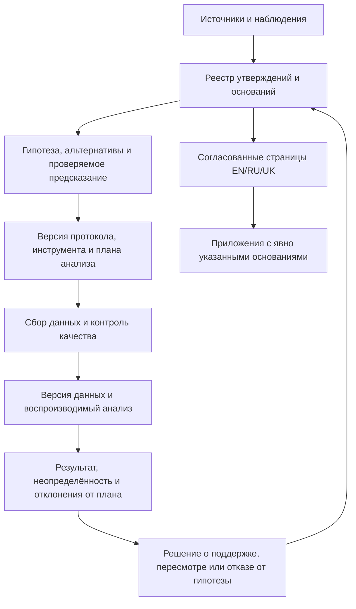

# Архитектурная оценка Before We Build — 6 сентября 2026

Before We Build имеет развитую архитектуру управления исследовательскими знаниями и подробно описанную программу проверки гипотез. Главный следующий этап — исполнить один полный цикл исследования: от отдельного вопроса и заранее зафиксированного метода до воспроизводимого результата и решения о пересмотре гипотезы. В проверенном репозитории завершение такого эмпирического цикла пока не показано.

Оценка относится к состоянию репозитория на commit `cfa7456161eb6cc21ab4f8661c734ec044de3581` и к доступным локальным материалам. Просмотрены структура, основные методологические документы, инструменты, выборка источников и записей рецензирования, скрипты и CI. Три отдельных AI-агента проверили эмпирический контур, измерение и происхождение утверждений. Это аналитический аудит с выборочным содержательным чтением, а не внешняя научная экспертиза всей базы. Назначение и основные требования использованных внешних стандартов сверены с первоисточниками 2026-09-06. Исследования, настройки защиты веток и данные вне доступного репозитория не оценивались.

**Основание оценки.** Вместо общей оценки из десяти использованы проверяемые состояния: правило описано; артефакт существует; исполнение проверено; результат независимо воспроизведён. Они применяются к отдельным частям системы, без суммирования в условный балл научности.

| Контур | Наблюдаемое состояние | Архитектурная оценка |
|---|---|---|
| Универсальное ядро и приложения | Границы закреплены в AGENTS.md и документах | Сильная модульная декомпозиция; эмпирическая отделимость предложенных процессов требует отдельной проверки |
| Wiki и локализация | 645 страниц, 215 полных EN/RU/UK групп; строгие проверки проходят | Рабочая архитектура docs-as-code с проверяемыми структурными контрактами |
| Источники и утверждения | Метаданные, статусы, библиография, отдельные подробные журналы поиска | Хорошая основа; детализация связи конкретного утверждения с источником неоднородна |
| Измерение | Есть последовательная программа и спецификации инструментов | Обоснованный проект будущей проверки; наличие спецификации не устанавливает валидность банка вопросов |
| Эмпирический цикл | Протоколы общего назначения, исследовательские заготовки и методологические кейсы | В проверенном контуре не обнаружен связанный пакет завершённого исследования с данными, анализом и результатом |
| Агенты | Единый реестр, канонические роли, генерируемые адаптеры и тесты | Хорошее разделение общей логики и средств исполнения; качество научных суждений требует поведенческой оценки |
| Публикация | Автоматическая сборка и проверка части свойств сайта | Полный набор quality-проверок не является явной зависимостью публикации в просмотренных workflow |

**Удачные архитектурные решения.**

Разделение `raw/`, `wiki/`, `research/`, `applications/` и `governance/` создаёт разные области ответственности. По смыслу это соответствует bounded contexts: источник, интерпретация, исследование и применение имеют разные контракты. Отделение универсального ядра от христианского приложения позволяет обсуждать общую модель без неявного переноса нормативных предпосылок одного приложения. Ценностно-нравственное основание правильно выделено как нормативная рамка; согласие, безопасность и достоинство не превращены в типологический балл. Основание: [AGENTS.md](../AGENTS.md), [README](../README.md).

Статусы утверждений, версии, одинаковые идентификаторы разделов, генерация каталога и проверки ссылок делают часть архитектурных правил исполняемой. Это практический аналог architecture fitness functions: система автоматически обнаруживает определённые нарушения контракта при изменениях. [Workflow качества](../.github/workflows/wiki-quality.yml) действительно запускает эти проверки. Их область действия — проверяемые свойства документов и инструментов, а смысловая непротиворечивость и эмпирическая обоснованность остаются отдельными задачами.

Агентная архитектура использует один источник инструкций и адаптеры для разных сред. Это соответствует принципу ports and adapters: роль и её ответственность отделены от формата конкретного клиента. Есть один владелец результата, ограниченная глубина делегирования, запрет конкурирующих редакторов одного артефакта и управляемая процедура изменения инструкций. [Описание ядра](../.agents/README.md) честно ограничивает обещания статической проверки и переносимости разрешений. [Правила организации](../.agents/ORGANIZATION.md) уже требуют учитывать полезность ролей и дублирование работы; новые роли стоит добавлять по наблюдаемому пробелу.

Программа проверки гипотез также существует: [validation-program](../wiki/concepts/validation-program-en.md) и [протокол разработки инструментов](../wiki/concepts/typology-test-design-protocol-en.md) предусматривают надёжность, различительную валидность, альтернативные объяснения и независимую проверочную выборку. Поэтому основная рекомендация — реализовать эту последовательность на узкой задаче. Дополнительный общий манифест не устранит разрыв между спецификацией и исполнением.

**Приоритетные находки и критерии исправления.**

1. **Первым центральным артефактом должно стать отдельное исследование.** В `research/` обнаружены 13 файлов, все Markdown; наличие кейсов и записанных методологических упражнений учтено. В просмотренных `research/`, `protocols/`, `governance/` и программных артефактах не обнаружена полная связка регистрации конкретного исследования, версии данных, исполняемого статистического анализа и отчёта о результатах. Собственная [оценка готовности outreach](../research/outreach/researcher-outreach-readiness.md) также фиксирует отсутствие валидированного пилотного результата. Это ограниченное наблюдение о репозитории, а не утверждение, что автор нигде не проводил исследований. Критерий следующего этапа: другой исследователь по одному идентификатору исследования находит протокол, версии материалов, доступные данные или правила доступа, код, результат и зарегистрированные отклонения от плана.

2. **Публичные статусы качества требуют точности.** [research/README.md](../research/README.md) называет инструменты `Validated`, тогда как [pilot-question-bank.md](../research/instruments/pilot-question-bank.md) прямо определяет банк как exploratory and unvalidated. Основной [README](../README.md) называет wiki `peer-reviewed`, но проверенные записи подтверждают ограниченные авторские и агентные проверки; из них нельзя заключить о независимой научной экспертизе всей wiki. Критерий исправления: каждая существенная отметка качества указывает вид проверки, её объём, версию материала и доступную запись решения. `active` означает состояние публикации, а статус эмпирических доказательств должен читаться отдельно.

3. **Нужна прослеживаемость важных утверждений до конкретного основания.** [validate_wiki.py](../scripts/validate_wiki.py) проверяет локальные пути, язык, `claim id/status` и согласованность метаданных. Он допускает пустой список claims, свободные библиографические подписи и не требует связи `claim → source → locator`. Например, [обзор агентных фреймворков](../wiki/sources/deep-research-report-en.md) использует `sources: [official project documentation]`; ссылки в тексте не дают отдельной версионной опоры для каждого сравнения. Это недостаток детализации происхождения, а не установленная ложность содержания. Критерий исправления: для центральных эмпирических выводов и ключевых проектных гипотез есть источник или явно указанное отсутствие внешнего основания, точное место в источнике, характер связи и версия интерпретации. Изменение основания должно показывать зависимые выводы и языковые страницы.

4. **Запись о review должна быть самостоятельным артефактом.** Валидатор проверяет лишь равенство `reviewed_semantic_version` и `semantic_version`. Личность рецензента, объём работы и хеш проверенного текста не обязательны. [Политика переводов](../wiki/concepts/multilingual-translation-policy-en.md) уже правильно различает структурную проверку и содержательное решение. Критерий исправления: короткая запись с типом рецензента, версией или хешем входа, проверенными утверждениями/разделами, находками и решением. Авторская проверка, отдельный AI-рецензент, проверка человеком и внешняя научная экспертиза должны быть различимы. Три языковые версии и несколько AI-ролей сами по себе не являются независимыми эмпирическими подтверждениями.

5. **Публикация должна зависеть от полного результата проверок той же версии.** [deploy-wiki.yml](../.github/workflows/deploy-wiki.yml) запускается на push и вручную, повторяет валидацию wiki, ссылок и читаемости, затем проверяет ссылки собранного сайта. Он не зависит явно от успешного завершения [wiki-quality.yml](../.github/workflows/wiki-quality.yml), где есть дополнительные тесты и проверки. По просмотренной конфигурации возможен запуск публикации без подтверждённого успеха всего набора на том же commit. Состояние GitHub branch protection не проверялось; установленного инцидента публикации не заявляется. Критерий исправления: сборка и публикация проходят через общий обязательный quality job или используют проверенный артефакт, однозначно связанный с тем же commit.

6. **Версия инструмента должна соответствовать версии конструкта.** Новая [спецификация соционики](../wiki/concepts/socionics-test-specification-en.md) разделяет операции и режимы позиций, ставит в основу выполнение задач, а самоотчёт делает вспомогательным.
   Раздел Socionics в [пилотном банке](../research/instruments/pilot-question-bank.md) содержит 16 самоотчётных пунктов, по два на аспект. Формулировки «Мне тяжело выстраивать строгие логические схемы…» и «Мне трудно управлять эмоциональной атмосферой…» могут смешивать предполагаемый процесс с уверенностью, опытом и субъективной способностью. Это содержательная угроза валидности, ещё не установленный эмпирический дефект. Развёрнутый интерфейс не проверялся.

   Критерий исправления: явное соответствие `версия конструкта → версия инструмента → покрываемые компоненты → допустимая интерпретация`. Старый банк получает однозначный статус относительно новой спецификации.

Хороший существующий образец работы с источниками — [каталог исследований пар](../research/compatibility-catalog/couples-search.md). Он связывает DOI и сведения о глубине доступа с [библиографическим snapshot](../raw/general/compatibility-research-catalog-2026-09-06-source-ledger.md), [карточками](../wiki/sources/compatibility-studies-couples-en.md) и [ограниченным review](compatibility-catalog-review-2026-09-06.md). В нём явно сохранены недоступные полные тексты и границы проверки. Эту практику можно распространить на приоритетные выводы, постепенно добавляя машинные связи.

**Сопоставление с современными методологиями.**

| Подход и первоисточник | Что он помогает проверить | Применение к BWB |
|---|---|---|
| [TOP 2025](https://www.cos.io/initiatives/top-guidelines), обновлённая рамка прозрачности исследований | Регистрация, протокол, план анализа, материалы, данные, код и отчётность; отдельно — проверка воспроизводимости | Перевести общие требования в пакет конкретного исследования и честно отмечать доступность каждого компонента |
| [Registered Reports](https://www.cos.io/initiatives/registered-reports) | Экспертная оценка плана до исследования и предварительное принятие публикацией | Подходящий возможный маршрут для подтверждающего этапа после разработки метода; обычная preregistration не равна Registered Report |
| [Theory Construction Methodology, 2021](https://pure.uva.nl/ws/files/68321294/1745691620969647.pdf) | Переход от эмпирических феноменов к прототеории, формальной модели и оценке объяснения | Выбрать один наблюдаемый процесс, получить различающиеся предсказания BWB и альтернатив; постепенно проверять необходимость каждого конструкта |
| [FAIR](https://www.nature.com/articles/sdata201618) | Находимость, доступность, совместимость и повторное использование исследовательских объектов | Идентификаторы, метаданные, происхождение, условия использования и доступа; чувствительные данные могут иметь ограниченный доступ |
| [W3C PROV](https://www.w3.org/TR/prov-overview/) | Связь артефактов, действий и ответственных | Записывать, какой источник/датасет и какая процедура породили утверждение; полноценная графовая БД для первого этапа необязательна |
| [RO-Crate](https://www.researchobject.org/ro-crate/specification/1.3/introduction.html) | Машиночитаемая упаковка связанных исследовательских материалов | Полезен при передаче или архивировании завершённого исследования; отсутствие RO-Crate у текущей wiki само по себе не дефект |
| [PRISMA 2020](https://www.prisma-statement.org/prisma-2020) | Полнота отчётности систематического обзора | Использовать при переходе к заявленному систематическому обзору; нынешний каталог честно назван выборочным поиском и не обязан изображать исчерпывающий обзор |
| [REFORMS, 2024](https://reforms.cs.princeton.edu/) | Прозрачность и воспроизводимость исследований с машинным обучением | Применять, когда ML станет частью анализа или прогнозирования; описать происхождение данных, предотвращение утечки, оценку обобщения и ограничения |

Это набор применимых ориентиров с разными назначениями. FAIR и RO-Crate не подтверждают истинность теории; PRISMA относится к отчётности обзоров; REFORMS особенно полезен при ML-анализе. Их наличие не заменяет корректный вопрос и информативный дизайн исследования.

**Предлагаемая целевая архитектура.**

Это целевой контур, а не заявление о его полном текущем исполнении. Согласие, ограничения доступа и проверка качества сопровождают соответствующие этапы. Нормативные положения не получают статус «доказанной моральной истины» из статистического анализа.

Для первого исследования достаточно небольшого пакета `research/studies/<study-id>/`: протокол, ссылка на регистрацию, версии инструмента и схемы кодирования, словарь переменных, описание доступа к данным, исполняемый анализ, зафиксированное окружение, результаты, отклонения от плана и решение по гипотезам. Это предлагаемая структура; каталог в рамках аудита не создавался. Участнические данные и ключи идентификации не следует автоматически складывать в публичный `raw/`, который сейчас хранит источники. У режима доступа к исследовательским данным должен быть собственный контракт.

Для происхождения утверждений на первом этапе достаточно JSON/YAML-реестра с устойчивыми идентификаторами и проверками ссылочной целостности. Можно постепенно добавить экспорт PROV/RO-Crate. Причин для немедленного перехода к микросервисам, графовой БД или сложной платформе распределённых вычислений в просмотренных материалах не обнаружено: такие решения стоит привязывать к измеренным ограничениям нагрузки, командной работы и объёма данных.

**Порядок развития.**

Сначала исправить неоднозначные статусы качества, связать публикацию с полным набором проверок и выбрать одну гипотезу с одним основным исходом. Для неё определить наблюдения, конкурирующее объяснение, отрицательный результат и условия, при которых инструмент не позволяет сделать вывод. Использовать уже существующие методологические документы как основание конкретного протокола.

Затем проверить понятность заданий и воспроизводимость кодирования на небольшом пилоте. Пилот должен показать, понимают ли участники задания и различают ли кодировщики предполагаемые процессы. Его размер определять по этой задаче; не обещать на небольшой удобной выборке проверку всей типологической системы. Данные разработки инструмента следует отличать от данных его последующей проверки.

Конкретный кандидат для научного ядра уже есть в [спецификации соционики](../wiki/concepts/socionics-test-specification-en.md): различение восстановления структурного правила и поиска результативного способа действия. Начать с когнитивных интервью, затем использовать параллельные задачи, повторное измерение и слепое кодирование. Сопоставить объяснение через две предполагаемые операции с общей успешностью решения, опытом и эффектом формата. Такой результат может показать пригодность наблюдений для различения операций. Вывод о полном типе, парной совместимости или природном происхождении предрасположенности потребует других исследований.

После замораживания версии инструмента провести отдельную проверку с заранее заданным планом, достаточной точностью или мощностью, учётом повторных наблюдений и зависимости участников пары. Сравнить предложенную модель с разумными альтернативами и базовыми предикторами. Для прогнозирования разделять данные на уровне, соответствующем заявлению об обобщении: новые люди, пары, периоды или площадки. При достаточной готовности возможно внешнее рецензирование протокола или Registered Report.

Пользу карты разговора исследовать отдельным маршрутом. Сравнение с сопоставимым структурированным разговором без типологических конструкций позволит оценивать добавочную пользу конкретных компонентов. Улучшение разговора само по себе не подтверждает устройство латентных процессов; слабый эффект конкретного интерфейса также не опровергает автоматически все теоретические гипотезы. При межъязыковых сравнениях равенство текста wiki следует отделять от проверки того, одинаково ли работает инструмент в языковых группах.

Для разговора пары экспериментальное условие следует назначать на уровне пары, если вмешательство относится к ней целиком, и анализировать зависимость наблюдений. При изучении вкладов обоих партнёров возможен APIM при подходящем вопросе и переменных; он сам по себе не даёт причинной интерпретации наблюдательных связей. Ориентиры: [описание APIM авторами](https://davidakenny.net/doc/APIM_MM.pdf) и [ITC Guidelines for Translating and Adapting Tests](https://www.intestcom.org/files/guideline_test_adaptation_2ed.pdf) для доказательства допустимости межъязыковых сравнений.

Для агентного контура следующая полезная инвестиция — небольшой набор представительских задач с внешне проверяемыми основаниями: извлечение источника, различение вывода автора и гипотезы BWB, обработка противоречащего результата, сохранение границ перевода. Фиксировать версию входа, роль/модель, результат и найденные ошибки. Число ролей и согласие нескольких AI-ответов не должны служить метрикой научного подтверждения.

**Проверки, выполненные при аудите.**

На указанном состоянии проекта прошли 110 unittest-тестов и все выполненные проверки: `validate_wiki.py --strict`, section IDs, wikilinks, claim-language audit, актуальность индекса и inventory, синхронизация адаптеров, static agent lint, научная читаемость wiki и указанного исходного текста, `git diff --check`. Машиночитаемый локальный журнал: `/tmp/bwb-architecture-audit-2026-09-06/results.json`; подробные логи лежат рядом. Эти результаты относятся к существующим техническим проверкам. Успех проверки читаемости означает прохождение её формальных правил, а не измерение понимания людьми.

Для готового отчёта дополнительно проверены локальные ссылки и формат изменений; проверка читаемости завершилась без блокирующих ошибок. Отдельный provenance-рецензент сверил изложение своих находок; две формулировки уточнены по его замечаниям.

Созданы только этот отчёт и запись о нём в журнале. Рекомендации по научной модели, инструментам, workflow и агентным правилам в рамках оценки не внедрялись. Wiki и её генерируемые каталоги не менялись; отчёт фиксирует состояние проекта и предложения, не вводит новые принятые теоретические утверждения.
